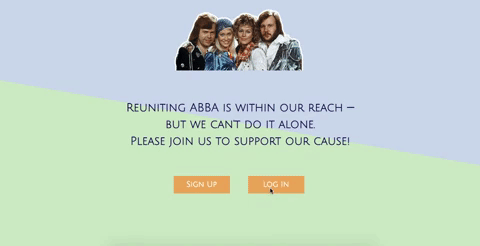
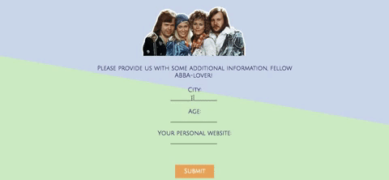
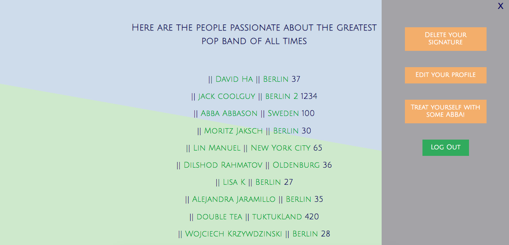

# A petition aimed to reunite ABBA

As a student project at SPICED Academy I built a petition site using Node.js, Express, PostgreSQL and Handlebars. 

First, the user can register or log in. 

  

Afterwards, the user is prompted to fill in additional information about themselves. After doing so they are also prompted to sign the petition. 

  

Upon signing, users can edit their profile, delete their signature, view fellow signers and filter signers by city. Moreover, a page providing the user with random ABBA facts and videos is included as well.

  

### Future Features
- Responsive design
- Display "your profile has been successfully updated" message
